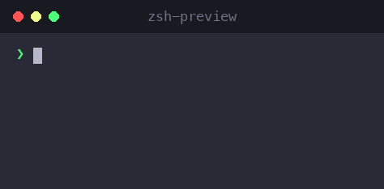

# zsh-preview

[English](./README.md) | **简体中文**

一个用于 [Zsh](https://www.zsh.org/) 的交互式别名查找器。当你输入命令时，它会对你的别名进行模糊匹配，把最相关的几个直接显示在终端里——然后只需按一个键就能选中。



如果你依赖各种短别名（`gco`、`gcm`、`dps`……），却总是记不清哪个是哪个，这个插件会实时列出最匹配的候选并让你即刻插入——再也不用猜，也不用 `alias | grep` 了。

## 特性

- **实时模糊推荐。** 输入时，消息区会显示最相关的 5 个别名，按相关度排序：完全匹配 > 前缀 > 子串 > 子序列。
- **带编号的候选。** 每个建议都标有 `1`–`5` 的编号，按下对应数字即可立即插入。
- **方向键选择。** 按 `↓` 激活菜单，用 `↑`/`↓` 移动选中项，按 `Tab` 确认。
- **无干扰。** 在你用 `↓` 激活菜单之前，`↑` 依然用于翻 shell 历史；没有菜单时，数字/`Tab` 保持原有行为。
- **命令过滤。** 只推荐展开后属于你关心的命令（如 `git`、`docker`）的别名。
- **智能消失。** 插入别名后菜单会自动隐藏，只有当你再次编辑该词时才重新出现。

## 使用方法

输入别名的开头几个字符，会弹出一个带编号的菜单：

```
   1. gc: git commit --verbose
   2. gcs: git commit --gpg-sign
   3. gcp: git cherry-pick
   4. gco: git checkout
   5. gcn: git commit --verbose --no-edit
```

然后用以下三种方式之一选择：

| 操作 | 按键 |
| --- | --- |
| 直接插入第 N 个建议 | `1` … `5` |
| 激活菜单 / 选中项下移 | `↓` |
| 选中项上移 | `↑`（激活后） |
| 插入当前高亮的建议 | `Tab` |
| 翻 shell 历史 | `↑`（激活菜单前） |

被选中的**别名本身**会被插入到命令行（例如 `gco`），其后已输入的内容会原样保留——按 `Enter` 照常执行即可。

## 安装

### Oh My Zsh

1. 将本仓库克隆到你的自定义插件目录：

```bash
git clone https://github.com/phongm/zsh-preview \
  ${ZSH_CUSTOM:-~/.oh-my-zsh/custom}/plugins/zsh-preview
```

2. 在 `~/.zshrc` 的 `plugins` 数组中加入 `zsh-preview`：

```zsh
plugins=(git zsh-preview)
```

3. 重新加载 shell：

```bash
source ~/.zshrc
```

### 手动安装（任意 Zsh 配置）

克隆仓库后，在 `~/.zshrc` 中 source 插件文件：

```zsh
source /path/to/zsh-preview/zsh-preview.plugin.zsh
```

## 配置

### `ALIAS_PREVIEW_COMMANDS`

只有展开后以这些命令开头的别名才会被推荐。默认为 `git docker`。编辑 `zsh-preview.plugin.zsh` 顶部的数组：

```zsh
typeset -ga ALIAS_PREVIEW_COMMANDS=(git docker)
```

例如 `gco='git checkout'` 会被推荐（匹配到 `git`），而 `ll='ls -alF'` 不会——除非你把 `ls` 加进列表。

### `ALIAS_PREVIEW_MAX`

显示的最大建议数（默认 `5`）。你可以在 `~/.zshrc` 中、插件加载**之前**覆盖它：

```zsh
ALIAS_PREVIEW_MAX=8
```

## 工作原理

插件挂钩 Zsh 的 `line-pre-redraw` 事件，在每次按键时刷新建议列表。它会对每个别名相对你正在输入的词打分——完全匹配得分最高，其次是前缀、子串，最后是子序列（模糊）匹配——并保留得分最高的 `ALIAS_PREVIEW_MAX` 个。选择操作由轻量级 ZLE widget 处理，当菜单未激活时会自动回退到你原有的按键绑定，因此正常编辑永远不会被打断。

## 兼容性

- Zsh（在 [Oh My Zsh](https://ohmyz.sh/) 下测试通过；可用于任何 Zsh 配置）
- 与 `zsh-autosuggestions` 和 `zsh-syntax-highlighting` 配合良好

## 许可证

[MIT](./LICENSE)
